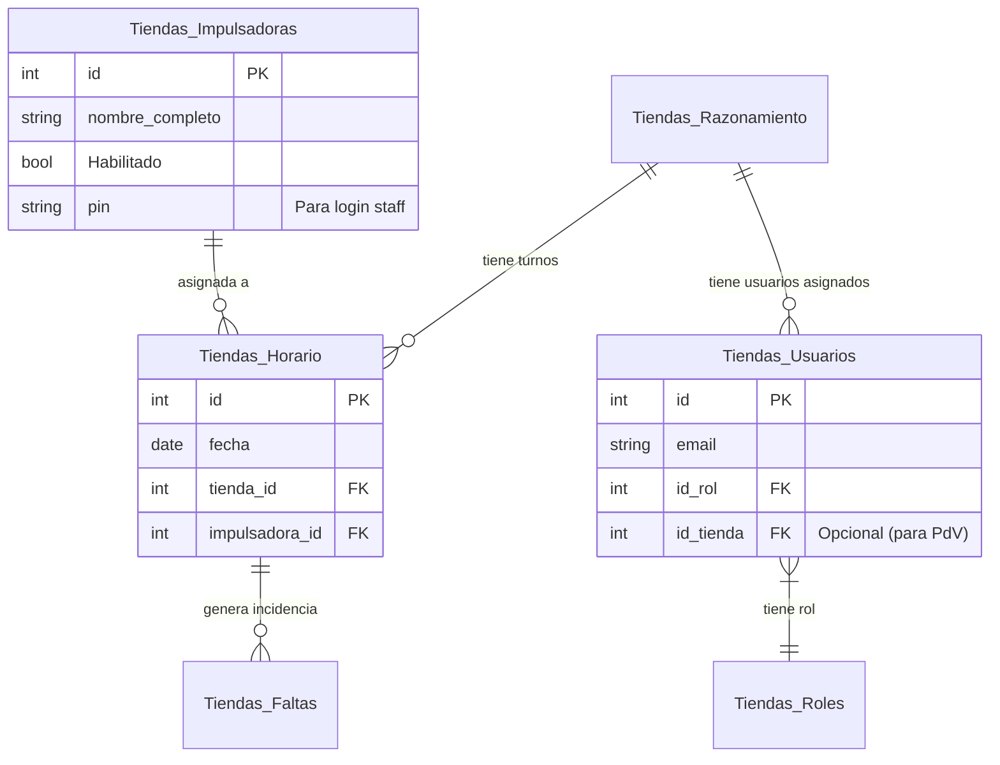

# StaffPlanner - Documentación del Proyecto

Este documento sirve como **fuente de verdad** para el contexto del proyecto, arquitectura, base de datos y despliegue.

---

## 🛠️ Stack Tecnológico

*   **Frontend**: HTML5, Vanilla JavaScript, CSS3.
*   **Estilos**: TailwindCSS (vía CDN).
*   **Iconos**: Google Material Icons.
*   **Backend / Base de Datos**: Supabase (PostgreSQL).
*   **Autenticación**: Supabase Auth & SessionStorage.
*   **Serverless**: Supabase Edge Functions (Deno).
*   **Email**: Resend (integrado vía Edge Functions).
*   **PDF**: html2canvas + jsPDF (Optimizado con expansión de texto y centrado automático).

---

## 🗄️ Esquema de Base de Datos

La base de datos está alojada en Supabase. A continuación, la estructura de las tablas principales y sus relaciones:

### 1. Tablas Principales

| Tabla | Descripción | Clave Primaria | Claves Foráneas / Relaciones |
| :--- | :--- | :--- | :--- |
| **`Tiendas_Razonamiento`** | Catálogo de Tiendas (Locales). | `id` | - |
| **`Tiendas_Impulsadoras`** | Catálogo de Personal (Impulsadoras). | `id` | `idBodega` -> `Tiendas_Razonamiento.id` (Relación opcional) |
| **`Tiendas_Horario`** | Asignación de días laborables. | `id` | `tienda_id` -> `Tiendas_Razonamiento.id` `impulsadora_id` -> `Tiendas_Impulsadoras.id` `categoria_asignada_id` -> `Tiendas_Categorias.id` |
| **`Tiendas_Faltas`** | Registro de incidencias (Faltas, Tardanzas). | `id` | `id_horario` -> `Tiendas_Horario.id` |
| **`Tiendas_Usuarios`** | Usuarios con acceso al sistema (Admin, Organizador, etc). | `id` | `id_rol` -> `Tiendas_Roles.id` `id_tienda` -> `Tiendas_Razonamiento.id` |
| **`Tiendas_Roles`** | Roles de usuario (Admin, Organizador, Staff, etc). | `id` | - |
| **`Tiendas_Categorias`** | Categorías de turnos/asignaciones. | `id` | `id_zona` |

### 2. Diagrama de Relaciones (Mermaid)

---

## 📧 Integraciones y Funciones Edge

### Envío de Correos (Resend)
El sistema utiliza **Supabase Edge Functions** para enviar notificaciones de correo electrónico a través de **Resend**.

*   **Función**: `send-incidence-email`
*   **Trigger**: Invocada desde el cliente (`index.html` / `calendario-tienda.html`) al registrar una falta.
*   **Flujo**:
    1.  Usuario reporta incidencia.
    2.  JS llama a `supabase.functions.invoke('send-incidence-email', body)`.
    3.  Edge Function recibe datos, formatea HTML y envía vía API de Resend.

---

## 📂 Estructura del Proyecto

*   `index.html`: **Vista Principal**. Calendario general, gestión de turnos completa, login principal.
*   `calendario-tienda.html`: **Vista Simplificada por Tienda**. Solo lectura + reporte de incidencias. Filtrado por local.
*   `supabase_edge_function_email.ts`: Código fuente de la función Cloud para emails.
*   `assets/`: (Si aplica) Recursos estáticos.

---

## 🚀 Despliegue (Cloudflare Pages)

Esta aplicación es estática (HTML/JS), por lo que se despliega fácilmente en cualquier host estático.

### Opción 1: Drag & Drop (Manual)
1.  Ir a [Cloudflare Dashboard](https://dash.cloudflare.com/) > **Workers & Pages**.
2.  **Create Application** > **Pages** > **Upload Assets**.
3.  Subir carpeta del proyecto.

### Opción 2: Git Integration (CI/CD - Actual)
El repositorio está conectado a Cloudflare Pages.
1.  **Push a GitHub**: Al hacer push a `master`, Cloudflare detecta cambios.
2.  **Build**: No requiere comando de build.
3.  **Directorio**: Root (`/`) o la carpeta especificada.

---

## 🔐 Autenticación y Seguridad

*   **Login General**: Email/Password contra `auth.users` de Supabase + validación en `Tiendas_Usuarios`.
*   **Login Staff (PIN)**: Validación contra campo `pin` en `Tiendas_Impulsadoras` (Rol ID 4).
*   **Persistencia**: `sessionStorage` maneja la sesión activa (`staffPlannerAuth`, `staffPlannerUser`).
*   **RLS (Row Level Security)**: Las tablas están protegidas en Supabase pero habilitadas para lectura `public` (anon) o autenticados según necesidad. `Tiendas_Horario` permite escritura pública (o autenticada) para incidencias.

---

## 📝 Notas de Desarrollo

*   **API Keys**: Se utilizan claves `publishable` en el frontend. **Nunca** exponer `service_role` key en archivos HTML/JS.
*   **Fechas**: Manejo de fechas local vs UTC. El calendario usa strings `YYYY-MM-DD` para evitar problemas de zona horaria.
*   **Colores**:
    *   `Tiendas_Razonamiento.color_hex`: Color identificativo de la tienda.
    *   `Tiendas_Impulsadoras.color` (Deprecado/No usado): Se prefiere usar color de tienda o paleta por defecto en vistas generales.
