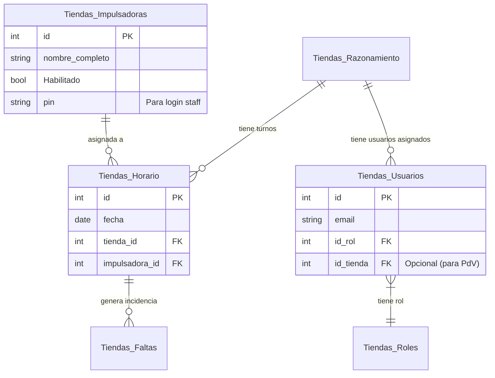
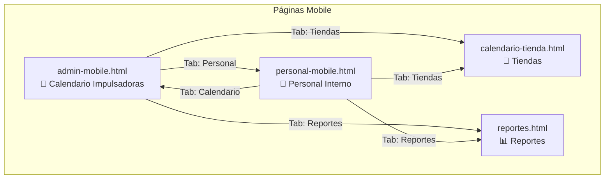
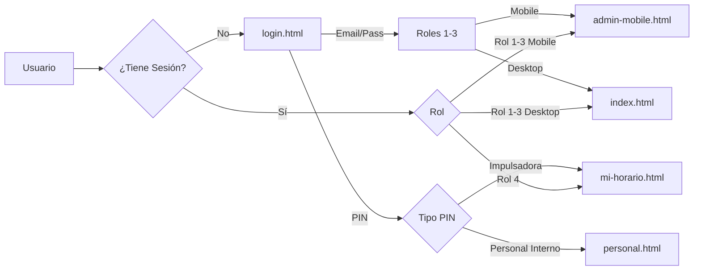

# StaffPlanner - Documentación del Proyecto

Este documento sirve como **fuente de verdad** para el contexto del proyecto, arquitectura, base de datos y despliegue.

---

## 🛠️ Stack Tecnológico

*   **Frontend**: HTML5, Vanilla JavaScript, CSS3.
*   **Estilos**: TailwindCSS (vía CDN).
*   **Iconos**: Google Material Icons.
*   **Backend / Base de Datos**: Supabase (PostgreSQL).
*   **Autenticación**: Supabase Auth & SessionStorage.
*   **Serverless**: Supabase Edge Functions (Deno).
*   **Email**: Resend (integrado vía Edge Functions).
*   **PDF**: html2canvas + jsPDF (Optimizado con expansión de texto y centrado automático).

---

## 🗄️ Esquema de Base de Datos

La base de datos está alojada en Supabase. A continuación, la estructura de las tablas principales y sus relaciones:

### 1. Tablas Principales

| Tabla | Descripción | Clave Primaria | Claves Foráneas / Relaciones |
| :--- | :--- | :--- | :--- |
| **`Tiendas_Razonamiento`** | Catálogo de Tiendas (Locales). | `id` | - |
| **`Tiendas_Impulsadoras`** | Catálogo de Personal (Impulsadoras). | `id` | `idBodega` -> `Tiendas_Razonamiento.id` (Relación opcional) |
| **`Tiendas_Horario`** | Asignación de días laborables. | `id` | `tienda_id` -> `Tiendas_Razonamiento.id` `impulsadora_id` -> `Tiendas_Impulsadoras.id` `categoria_asignada_id` -> `Tiendas_Categorias.id` |
| **`Tiendas_Faltas`** | Registro de incidencias (Faltas, Tardanzas). | `id` | `id_horario` -> `Tiendas_Horario.id` |
| **`Tiendas_Usuarios`** | Usuarios con acceso al sistema (Admin, Organizador, etc). | `id` | `id_rol` -> `Tiendas_Roles.id` `id_tienda` -> `Tiendas_Razonamiento.id` |
| **`Tiendas_Roles`** | Roles de usuario (Admin, Organizador, Staff, etc). | `id` | - |
| **`Tiendas_Categorias`** | Categorías de turnos/asignaciones. | `id` | `id_zona` |

### 2. Diagrama de Relaciones (Mermaid)

---

## 📧 Integraciones y Funciones Edge

### Envío de Correos (Resend)
El sistema utiliza **Supabase Edge Functions** para enviar notificaciones de correo electrónico a través de **Resend**.

*   **Función**: `send-incidence-email`
*   **Trigger**: Invocada desde el cliente (`index.html` / `calendario-tienda.html`) al registrar una falta.
*   **Flujo**:
    1.  Usuario reporta incidencia.
    2.  JS llama a `supabase.functions.invoke('send-incidence-email', body)`.
    3.  Edge Function recibe datos, formatea HTML y envía vía API de Resend.

---

## 📂 Estructura del Proyecto

### Páginas Desktop (Pantalla Completa)
| Archivo | Descripción | Acceso |
|---------|-------------|--------|
| `login.html` | Página de Login. Autenticación dual: Email/Password + PIN | Público |
| `index.html` | Vista Principal. Calendario mensual, gestión completa de turnos | Rol 1-3 |
| `personal.html` | Gestión Personal Interno. Calendario mensual por bodega | Rol 1-3 |
| `reportes.html` | Historial de Incidencias. Filtros y exportación CSV | Rol 1-3 |
| `calendario-tienda.html` | Vista por Tienda. Solo lectura + reporte incidencias | Rol 1-3 |

### Páginas Mobile (Optimizadas para Móvil)
| Archivo | Descripción | Acceso |
|---------|-------------|--------|
| `admin-mobile.html` | Dashboard Admin Móvil. Vista diaria de Impulsadoras | Rol 1-3 |
| `personal-mobile.html` | Personal Interno Móvil. Vista diaria por bodega | Rol 1-3 |
| `mi-horario.html` | Horario Personal. Vista para Impulsadoras (login PIN) | Rol 4 |

### Otros Archivos
*   `supabase_edge_function_email.ts`: Código fuente de la función Cloud para emails.
*   `assets/`: (Si aplica) Recursos estáticos.

---

## 🧭 Flujo de Navegación

### Diagrama de Navegación Mobile

### Navbar Mobile (Tabs Inferiores)

El navbar inferior en las páginas mobile conecta:

| Tab | admin-mobile.html | personal-mobile.html |
|-----|-------------------|----------------------|
| 📅 Calendario | *(Actual)* | → admin-mobile.html |
| 👥 Staff/Personal | → personal-mobile.html | *(Actual)* |
| 🏪 Tiendas | → calendario-tienda.html | → calendario-tienda.html |
| 📊 Reportes | → reportes.html | → reportes.html |
| 👤 Perfil | Modal logout | Modal logout |

### Flujo de Autenticación

---

## 🚀 Despliegue (Cloudflare Pages)

Esta aplicación es estática (HTML/JS), por lo que se despliega fácilmente en cualquier host estático.

### Opción 1: Drag & Drop (Manual)
1.  Ir a [Cloudflare Dashboard](https://dash.cloudflare.com/) > **Workers & Pages**.
2.  **Create Application** > **Pages** > **Upload Assets**.
3.  Subir carpeta del proyecto.

### Opción 2: Git Integration (CI/CD - Actual)
El repositorio está conectado a Cloudflare Pages.
1.  **Push a GitHub**: Al hacer push a `master`, Cloudflare detecta cambios.
2.  **Build**: No requiere comando de build.
3.  **Directorio**: Root (`/`) o la carpeta especificada.

---

## 🔐 Autenticación y Seguridad

### Métodos de Login
| Método | Descripción | Validación | Destino |
|--------|-------------|------------|---------|
| Email/Password | Admin, Organizador, PdV | Supabase Auth + `Tiendas_Usuarios` | index.html / admin-mobile.html |
| PIN (Impulsadora) | Staff de ventas | `Tiendas_Impulsadoras.pin` | mi-horario.html |
| PIN (Personal) | Personal interno | `Tiendas_Personal.pin` | personal.html |

### Roles del Sistema
| ID | Nombre | Permisos |
|----|--------|----------|
| 1 | Admin | CRUD completo + usuarios |
| 2 | Organizador | CRUD turnos + incidencias |
| 3 | Punto de Venta (PdV) | Solo reportar incidencias |
| 4 | Impulsadora | Ver su horario (solo lectura) |

### Persistencia de Sesión
*   `sessionStorage.staffPlannerAuth`: Estado de autenticación (`'true'`/`'false'`)
*   `sessionStorage.staffPlannerRoleId`: ID del rol del usuario
*   `sessionStorage.staffPlannerUser`: Objeto JSON con datos del usuario
*   `sessionStorage.staffPlannerRoleName`: Nombre legible del rol
*   `sessionStorage.staffPlannerUserId`: ID del usuario en BD

### RLS (Row Level Security)
Las tablas están protegidas en Supabase. `Tiendas_Horario` permite escritura pública para incidencias.

---

## 📝 Notas de Desarrollo

### Tecnologías y Dependencias
*   **SweetAlert2**: Modals y confirmaciones (CDN)
*   **TailwindCSS**: Estilos (CDN)
*   **Material Icons**: Iconografía (Google Fonts)
*   **Supabase JS**: Cliente de base de datos

### Convenciones
*   **Fechas**: Formato `YYYY-MM-DD` para evitar problemas de timezone.
*   **Colores de Tienda**: `Tiendas_Razonamiento.color_hex` identifica visualmente cada local.
*   **API Keys**: Solo claves `publishable` en frontend. **Nunca** exponer `service_role`.

### Tablas de Base de Datos Principales
| Tabla | Uso |
|-------|-----|
| `Tiendas_Horario` | Turnos de Impulsadoras |
| `Tiendas_Personal_Horario` | Turnos de Personal Interno |
| `Tiendas_Impulsadoras` | Catálogo de Impulsadoras |
| `Tiendas_Personal` | Catálogo de Personal Interno |
| `Tiendas_Razonamiento` | Catálogo de Tiendas/Bodegas |
| `Tiendas_Faltas` | Registro de Incidencias |
| `Tiendas_Usuarios` | Usuarios del sistema |
| `Tiendas_Roles` | Roles de acceso |
| `Tiendas_Categorias` | Categorías/Zonas de trabajo |

